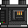
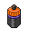

# README - MEMEMinc simulation alpha V1
Bienvenue dans **MEMEMinc simulation**, un jeu crée par Leynaïck Duthieuw, Charlilou Maes et Mathys Kraim-Grisoni durant le semestre 1 du parcours d'innovation 2024 à l'ESME.
---

## À propos du jeu

Dans **MEMEinc simulation**, votre objectif est de collecter des ressources, construire des infrastructures, et de transformer ce monde en usine pour créer et optimiser le plus possible !

---

## But du jeu

- Ramasser des ressources au sol.
- Fabriquer vos premières machines pour collercter des ressources.
- créer vos premierès lignes de production.
- Vous étendre un maximum

---

## Commandes

Voici les commandes de base pour commencer :

### Mouvements
- **Z/Q/S/D** : Déplacer la caméra.

### Actions
- **Clic gauche** : Ramasser un objets.
- **Clic droit** : Poser objet/remplir machine.
- **R** : Tourner le bloc.
- **E** : Ouvrir l'inventaire.
- **ESC** : Ouvrir les options.
- **C** : Ouvrir les crafts.
- **M** : Ouvrir la minimap.
- **Tab** : Déplacement dans la bar d'inventaire.

---

## Premières étapes

1. **Récolter des ressources de base** : Récoltez les ressources naturelles pour fabriquer vos première machines.
2. **Production d'énergie** : Centrale à vapeur ou panneau solaire.
3. **Fabriquer des machines** :Créez des foreuses et des four pour exploiter les gisements.
4. **Autotmatiser** : Utilisez des presses et des étireuses pour produire automatiquement vos composants.

---

## Fonctionnement des objets

### Foreuse   
- Puise le cuivre, le fer
### Tapis   
- Transporte des objets en prenant celui derrière lui.
- Dépose l'objet dans la machine devant lui.
- Ne nécessite pas d'énergie.

### Tuyaux   
- Transport des liquides dans la même logique que les tapis
- Ne nécessite pas d'énergie.

### Four   
- craft des lingots de cuivre ou de fer avec les minerais et de l'ernergie ou du charbon
- craft de l'acier à partir de lingoits de fer

### Presse   
- craft des plaques d'acier ou de cuivre à partir de lingots
- craft des engrenage à partir de plaques d'acier

### Étireuse   
- craft des barre d'acier ou de cuivre à partir de lingots
- craft des fils électrique à partir de barres de cuivre

### Centrale   
- génère de l'énergie avec de l'eau et du charbon ou du pétrole

### Bobine Tesla  
- Transporte 1 d'énergie dans un carré de 3 cases autour d'elle, nécessite d'être placé contre une machine pour l'allimenté

### Batterie  
- stocke jusqu'à 100 énergie

### Panneau Solaire  
- génère 1 d'énergie tous les intervals

### Coffre 
- Ajoute à l'inventaire l'objet qu'on lui apporte par convoyeur

---

## Support et commentaires

Si vous avez des questions ou des suggestions, n’hésitez pas à contacter notre équipe via [charlilou.maes@gmail.com].

Bonne chance et amusez-vous bien dans **MEMEinc simulation** !

