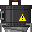

# README - MEMEMinc simulation alpha V1

Bienvenue dans **MEMEMinc simulation**, un jeu crée par Leynaïck Duthieuw, Charlilou Maes et Mathys Kraim-Grisoni durant le semestre 1 du parcours d'innovation 2024 à l'ESME.
---

## À propos du jeu

Dans **MEMEinc simulation**, votre objectif est de collecter des ressources, construire des infrastructures, et de transformer ce monde en usine pour créer et optimiser le plus possible !

---

## But du jeu

- Ramasser des ressources au sol.
- Fabriquer vos premières machines pour collercter des ressources.
- créer vos premierès lignes de production.
- Vous étendre un maximum

---

## Commandes

Voici les commandes de base pour commencer :

### Mouvements
- **Z/Q/S/D** : Déplacer la caméra.

### Actions
- **Clic gauche** : Ramasser un objets
- **Clic droit** : Poser objet/remplir machine
- **E** : Ouvrir l'inventaire
- **ESC** : Ouvrir les options.
- **C** : Ouvrir les crafts.
- **M** : Ouvrir la minimap.
- **Tab** : Déplacement dans la bar d'inventaire.

---

## Premières étapes

1. **Récolter des ressources de base** : Récoltez les ressources naturelles pour fabriquer vos première machines.
2. **Production d'énergie** : Centrale à vapeur ou panneau solaire.
3. **Fabriquer des machines** :Créez des foreuses et des four pour exploiter les gisements.
4. **Autotmatiser** : Utilisez des presses et des étireuses pour produire automatiquement vos composants.

---

## Fonctionnement des objets

### Foreuse

- **Outils** : Chaque outil (pioche, hache, marteau) a une durée de vie et permet de récolter des ressources spécifiques.
- **Armes** : Varient en puissance, portée et durée de vie. Les armes à distance nécessitent des munitions.
- **Consommables** : Nourriture et potions pour restaurer votre santé ou vos énergies.

### Convoyeur

- **Blocs** : Utilisés pour bâtir des structures (murs, planchers, toits).
- **Machines** : Fournissent des fonctionnalités avancées, comme le raffinage des ressources ou la production d'énergie.

### Four

- **Artefacts** : Objets rares offrant des pouvoirs uniques ou débloquant de nouvelles zones.
- **Clés** : Nécessaires pour accéder à certains endroits verrouillés.

---

## Support et commentaires

Si vous avez des questions ou des suggestions, n’hésitez pas à contacter notre équipe via [charlilou.maes@gmail.com].

Bonne chance et amusez-vous bien dans **MEMEinc simulation** !

